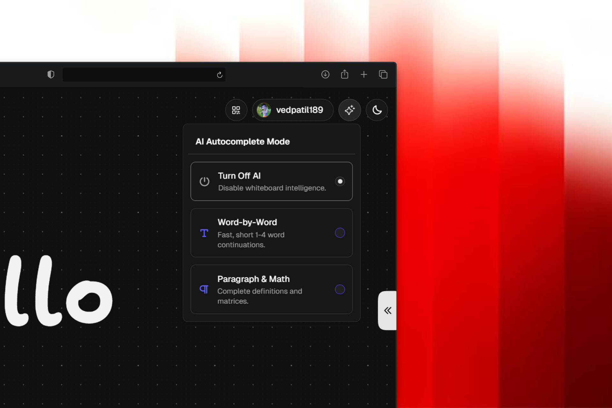
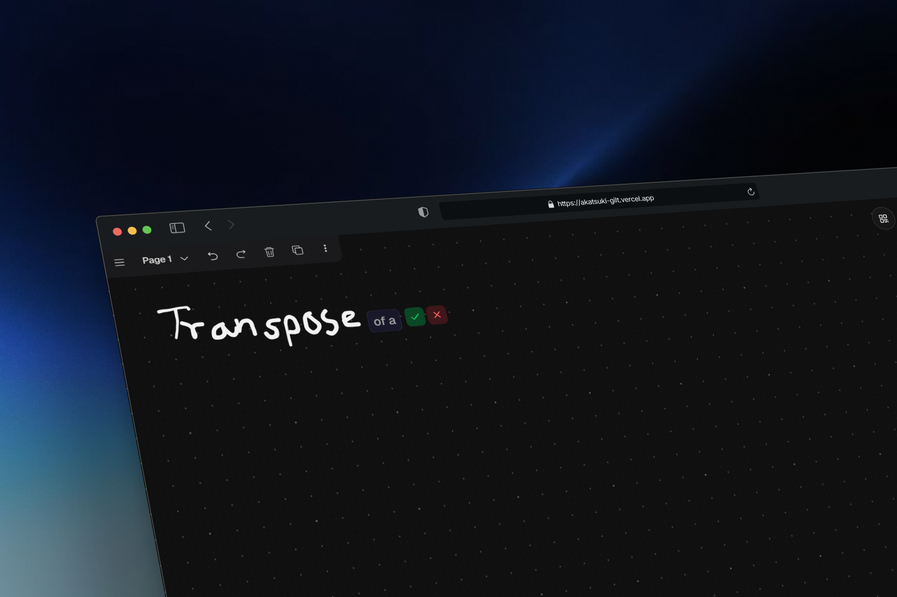
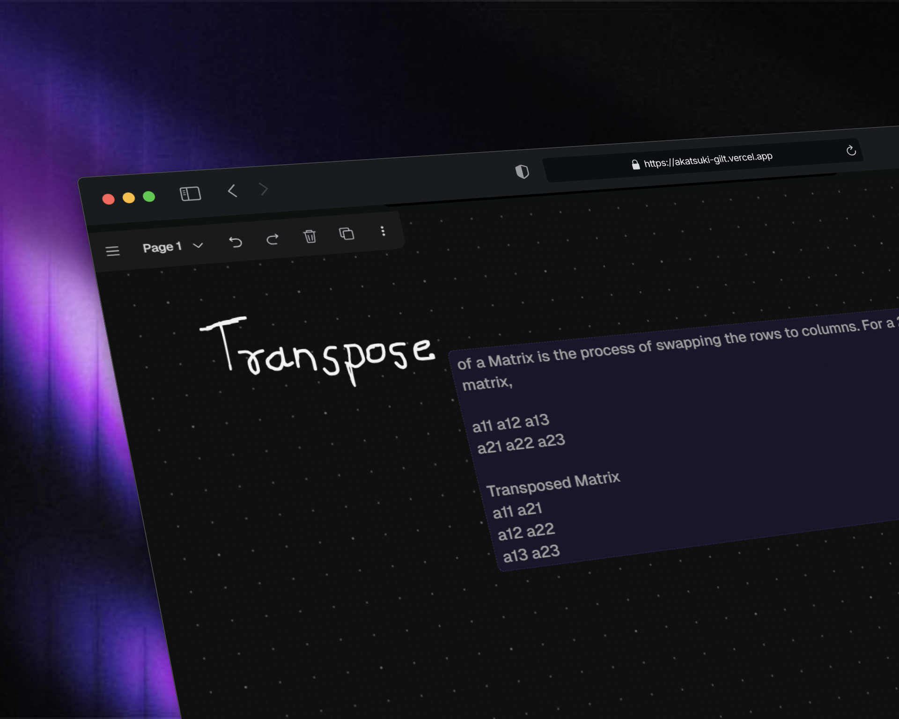
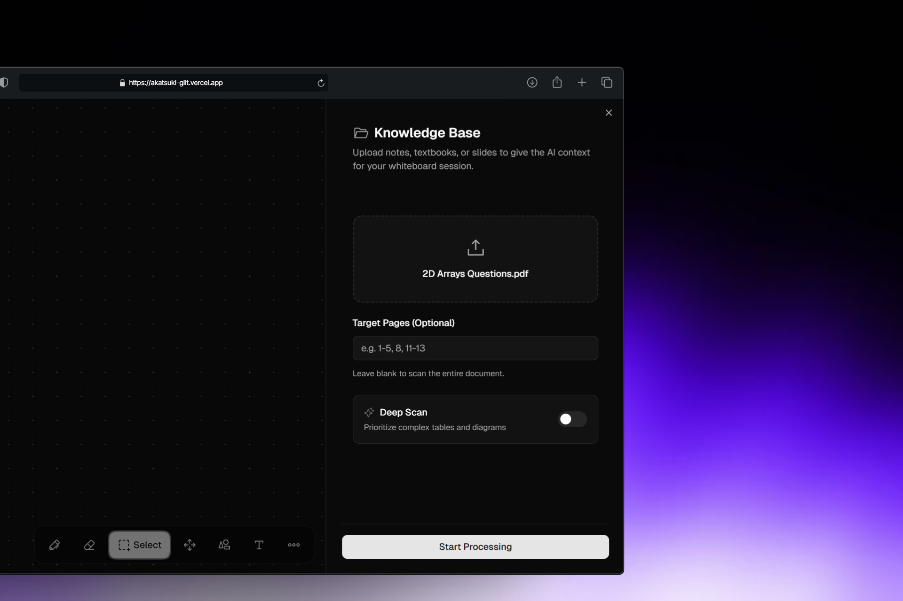
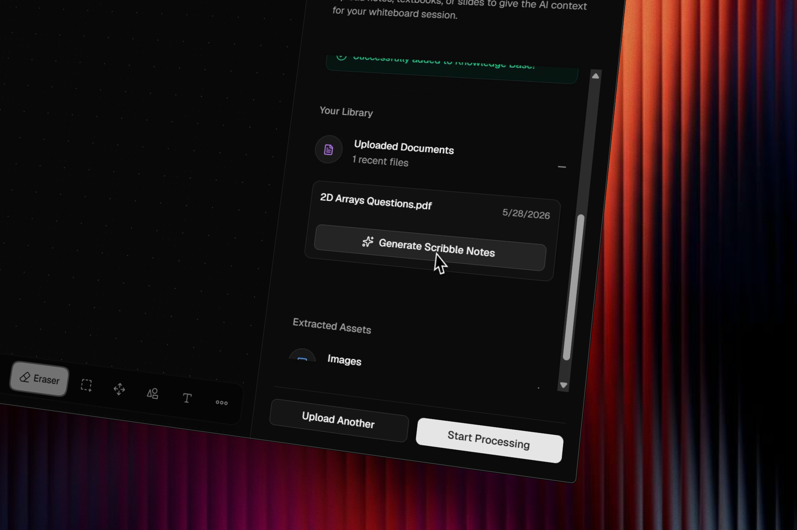

<div align="center">
  
# ☁️ Akatsuki Canvas 🖋️
**The AI-Powered Interactive Whiteboard for Educators**

[](https://nextjs.org/)
[](https://react.dev/)
[](https://supabase.com/)
[](https://opensource.org/licenses/MIT)

[Live](https://akatsuki-gilt.vercel.app/board) · [Report Bug](https://github.com/VedantPatil-99/akatsuki/issues) · [Request Feature](https://github.com/VedantPatil-99/akatsuki/issues)

*An AI-powered interactive digital whiteboard designed for educators, featuring real-time handwriting recognition, context-aware autocompletion, and a robust Retrieval-Augmented Generation (RAG) pipeline.*

</div>

> **Akatsuki Canvas** is an AI-powered interactive whiteboard for educators. Upload course materials, write on the canvas, and get **ghost text** predictions grounded in your documents — handwriting is read via vision OCR, context is retrieved with hybrid search, and completions render inline until you accept with `Tab`.

---

## Table of Contents

- [How It Works](#how-it-works)
- [Features](#features)
- [Architecture](#architecture)
- [Tech Stack](#tech-stack)
- [Local Development](#local-development)
- [Project Structure](#project-structure)
- [Screenshots](#screenshots)
- [Contributing](#contributing)
- [Credits](#credits)

---

## How It Works

```
1. INGEST ──────────────────────────────────────────────────────────
   Drop PDFs, PPTX, or DOCX into the Knowledge Panel.
   LlamaParse extracts structured Markdown from each file.

2. CHUNK & INDEX ───────────────────────────────────────────────────
   LangChain splitters preserve tables and math (dual-chunking).
   Cohere embeddings land in Supabase pgvector (async via QStash).

3. WRITE & OCR ─────────────────────────────────────────────────────
   Pen strokes pause → canvas snapshot → Gemini 2.5 Flash
   transcribes handwriting, math, and sketches to text/LaTeX.

4. PREDICT ───────────────────────────────────────────────────────────
   Hybrid search (BM25 + cosine) pulls curriculum context.
   Groq (Llama 3.1) streams the next phrase as ghost text on canvas.

5. ACCEPT ────────────────────────────────────────────────────────────
   Press Tab → ghost UI clears → native Tldraw text shape at
   the same coordinates.
```

---

## Features

| Area                | Highlights                                                                                                                                       |
| ------------------- | ------------------------------------------------------------------------------------------------------------------------------------------------ |
| **Ghost text**      | Context-aware autocomplete for words, equations, and code; word / sentence / off modes; viewport-aware wrapping for matrices and indented blocks |
| **Handwriting**     | Stroke capture + Gemini vision OCR; accepted predictions become native Tldraw shapes                                                             |
| **RAG pipeline**    | LlamaParse + LangChain structural chunking; optional **Deep Scan** for images, Mermaid diagrams, and LaTeX                                       |
| **Knowledge panel** | Drag-and-drop uploads; extracted images and links in accordions; gallery modal with one-click canvas injection                                   |
| **Scribble notes**  | Multi-agent background jobs produce study PDFs (Active Recall zones, Rough.js doodles, QR links to sources)                                      |
| **Quick Share**     | WebRTC P2P file transfer; QR handshake; connection status UI; assets ready for the board                                                         |
| **Auth**            | Guest mode with lazy registration; Supabase auth with guest/account conflict handling                                                            |
| **Canvas UI**       | Custom Tldraw toolbar; dark/light sync via `next-themes`; circuit-board gradient background                                                      |

---

## Architecture

```
┌─────────────────────────────────────────────────────────────────┐
│                     Browser (Next.js + Tldraw)                  │
│  Pen strokes → debounce → OCR (Gemini) → hybrid search (RPC)    │
│                              ↓                                  │
│                    Groq completion → ghost text                 │
└──────────────────────────────┬──────────────────────────────────┘
                               │
        ┌──────────────────────┼──────────────────────┐
        ▼                      ▼                      ▼
  Supabase (Auth,        QStash webhooks         External extractor
   Storage, pgvector)    → parse / embed          (Python service)
```

| Route                 | Role                                    |
| --------------------- | --------------------------------------- |
| `api/ai/autocomplete` | OCR, hybrid retrieval, Groq inference   |
| `api/upload`          | Storage + enqueue background processing |
| `api/process`         | QStash worker: parse, chunk, embed      |
| `api/scribble`        | Multi-agent note generation             |

---

## Tech Stack

**Frontend** — Next.js 16 (App Router), React 19, TypeScript, Tailwind CSS v4, Zustand, Tldraw

**Data** — Supabase (Auth, Storage, PostgreSQL + pgvector)

**AI** — Groq (Llama 3.1), Google Gemini 2.5 Flash, Cohere embeddings, LlamaCloud (LlamaParse)

**Jobs** — Upstash QStash

---

## Local Development

### Prerequisites

- [Node.js 20+](https://nodejs.org/)
- [Bun](https://bun.sh/) (recommended) or npm

### Setup

```bash
git clone https://github.com/VedantPatil-99/akatsuki.git
cd akatsuki
cp .env.example .env   # fill in Supabase, AI keys, QStash, etc.
bun install
bun run dev
```

Open **[http://localhost:3000/board](http://localhost:3000/board)**.

Copy variable names and comments from `[.env.example](.env.example)`. You need at minimum: Supabase URL/keys, Cohere, Gemini, Groq, LlamaCloud, QStash signing keys, and `NEXT_PUBLIC_TLDRAW_LICENSE_KEY` for production canvas use.

### Quick workflow

1. Upload a document in the Knowledge Panel and wait for indexing.
2. Draw with the pen; pause to trigger ghost text.
3. Press `Tab` to accept a prediction, or keep writing to dismiss it.

---

## Project Structure

```
src/
├── app/
│   ├── api/ai/autocomplete/   # OCR + RAG + completion
│   ├── api/process/           # QStash ingestion worker
│   ├── api/scribble/          # Study-note generation
│   ├── api/upload/            # Upload + queue
│   └── board/                 # Main whiteboard route
├── components/
│   ├── auth/                  # Login, guest upgrade, conflict modals
│   └── canvas/                # Tldraw wrapper, knowledge panel, Quick Share
└── lib/
    ├── hooks/                 # Handwriting capture, debounce
    ├── rag/                   # Parser, splitter, embedder
    └── supabase/              # Server / client / admin clients
```

---

## Screenshots

### AI autocompletion
<div align="center">
  
  
  
</div>

### Knowledge panel & study notes

<div align="center">
  
  
</div>

---

## Contributing

1. Do not push directly to `main`.
2. Use focused branches and open a PR.
3. Prefer conventional commits (`feat:`, `fix:`, `docs:`).

---

## Credits

| Name             | Role                                                                  |
| ---------------- | --------------------------------------------------------------------- |
| **Vedant Patil** | Lead developer — [@VedantPatil-99](https://github.com/VedantPatil-99) |
| **Aditya Yadav** | Contributor — [@Adityadav999](https://github.com/Adityadav999)        |

---

## License

MIT
